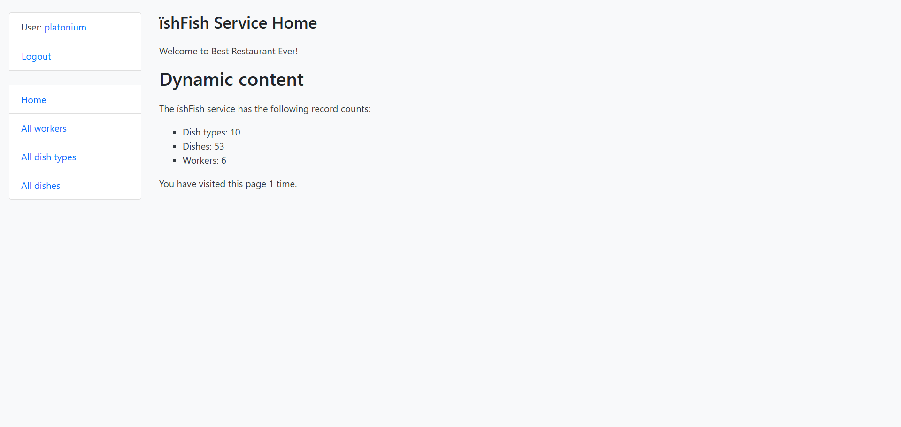
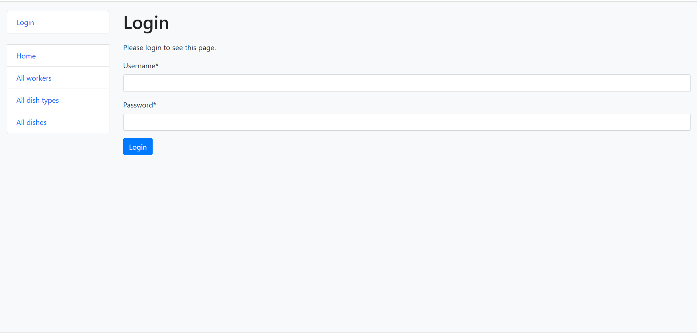
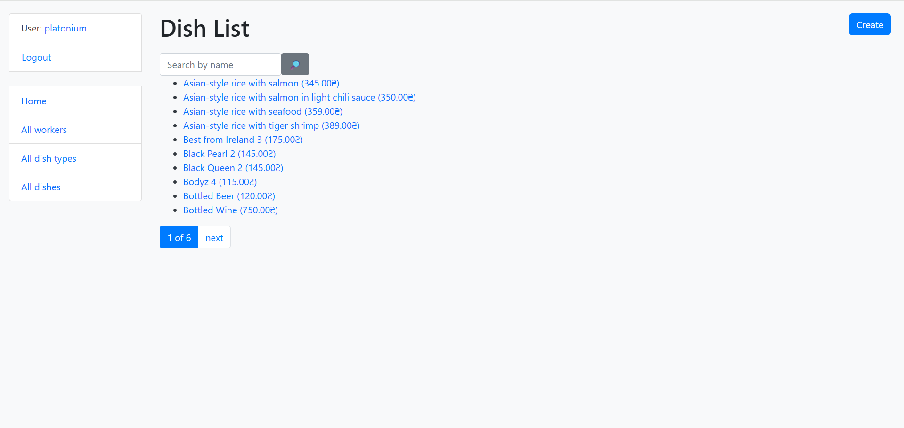
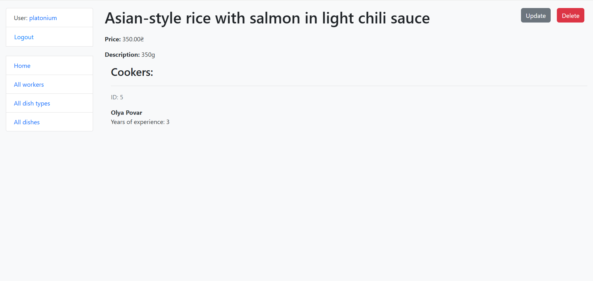
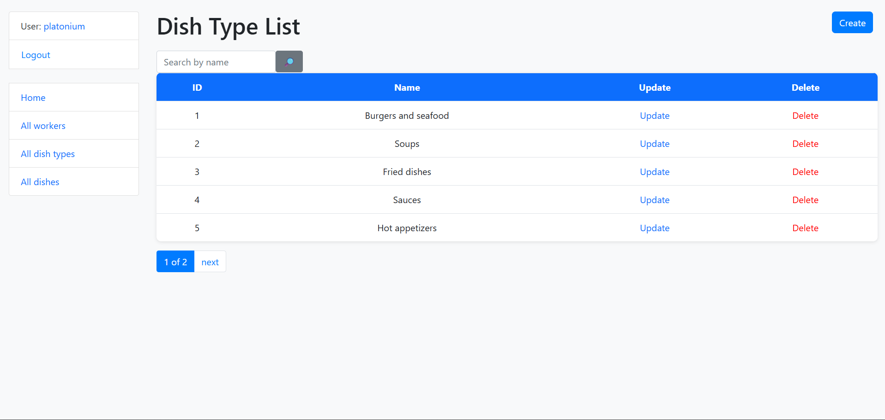
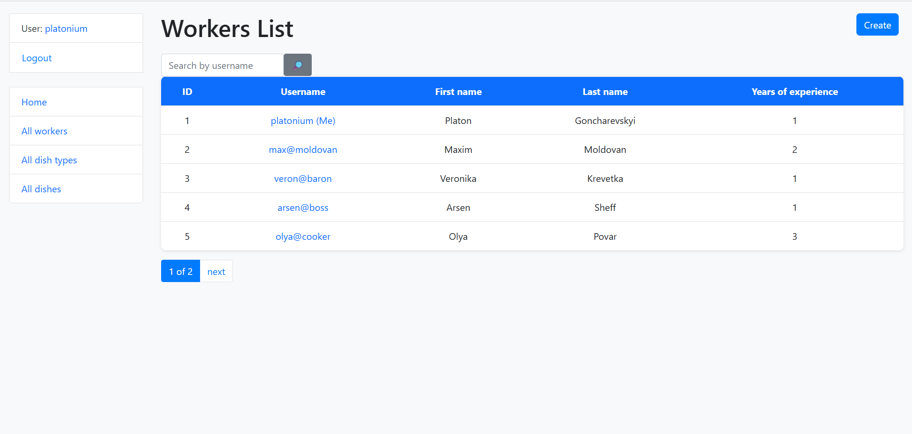
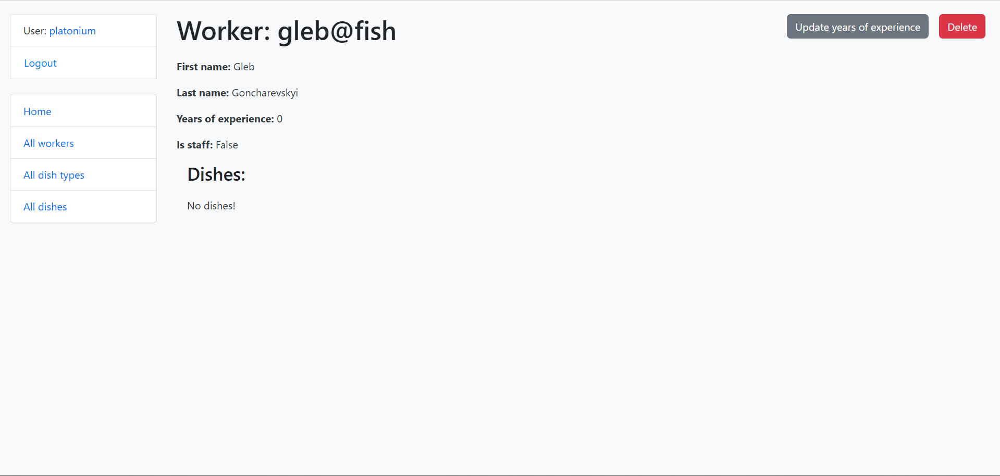

# ЇshFish 🍽️

My first Django project, inspired by my experience working in a restaurant.
The goal is to improve communication and organization in the kitchen.

## What the project does

- Chefs can create new dishes and their types.
- Assign responsible chefs for cooking dishes.
- Convenient menu management and internal processes in the kitchen.

## Technologies

- Python 3.x
- Django 4.x
- Bootstrap 4

## Structure

- `restaurant/` — logic of dishes and chefs
- `templates/` — HTML templates
- `static/` — CSS and static files

## Screenshots

**Home page**

**Login page**

**Dish list**

**Dish detail**

**Dish type list**

**Workers list**

**Worker detail**

